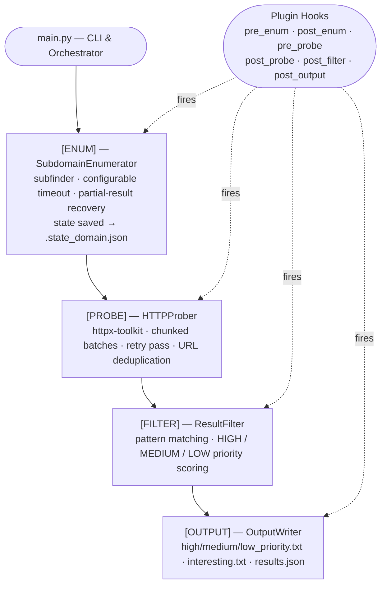

# recon-platform


A modular reconnaissance orchestration framework for structured, repeatable external attack surface mapping.

---

## Overview

recon-platform is a security engineering tool that orchestrates industry-standard reconnaissance tooling behind a clean Python pipeline. It produces consistent, structured output on every run and is designed to be extended privately — proprietary detection logic and operational methodology remain completely outside the public repository.

This is not a collection of scripts. It is a pipeline framework with a defined data model, an event-driven plugin system, and deliberate separation between public infrastructure and private research.

> **Core dependency chain:** `subfinder` → `httpx-toolkit` → Python stdlib only.

---

## Key Features

| Capability | Detail |
|:---|:---|
| Subdomain enumeration | subfinder with configurable threads and wall-clock timeout |
| HTTP probing | httpx-toolkit — title, status code, and technology detection |
| Chunked processing | Large host lists probed in configurable batches with per-chunk progress |
| Retry pass | Non-responding hosts re-probed once with a doubled per-request timeout |
| Graceful timeout recovery | Partial subfinder results preserved on timeout; pipeline continues |
| Deduplication | URL-level deduplication across all chunks and retry passes |
| Resumable scans | Enumeration state persisted after each run; `--resume` skips re-enumeration |
| Priority scoring | HIGH / MEDIUM / LOW assigned to every finding |
| Auto-categorisation | Login pages, admin panels, API endpoints, staging environments, dashboards |
| Priority output files | Dedicated per-tier files for direct operational triage |
| Structured reporting | JSON report with full metadata, statistics, and technology distribution |
| Plugin system | Hook-based extensions at every pipeline stage boundary |
| Public/private separation | Private plugins and methodology are git-ignored by design |
| Zero runtime dependencies | Core framework requires only the Python standard library |
| Environment-variable config | Every default overridable without source changes |
| Docker support | Single-command containerised execution |

---

## Architecture

```
recon-platform/
│
├── main.py                    CLI entry point and pipeline orchestrator
│
├── core/
│   ├── subdomains.py          SubdomainEnumerator  — wraps subfinder
│   ├── probe.py               HTTPProber + HostResult — wraps httpx-toolkit
│   ├── filters.py             ResultFilter — categorisation and scoring
│   ├── output.py              OutputWriter — all result files and JSON report
│   ├── utils.py               subprocess wrapper, path helpers, deduplication
│   └── logger.py              Centralised logging configuration
│
├── plugins/
│   ├── loader.py              PluginRegistry + PluginLoader
│   └── sample_plugin.py       Reference plugin showing all hook points
│
├── private_modules/           [git-ignored] drop proprietary plugins here
│
├── config/
│   └── settings.py            All tunables — env-var overridable
│
├── tests/
│   ├── test_utils.py
│   ├── test_probe.py
│   ├── test_filters.py
│   ├── test_state.py
│   └── test_subdomains.py
│
├── docs/
│   └── PRIVATE_NOTES.md       [git-ignored] internal methodology notes
│
└── output/                    [git-ignored] scan results written here
```

---

## Workflow Pipeline



---

## Installation

### 1. Clone

```bash
git clone https://github.com/your-username/recon-platform.git
cd recon-platform
```

### 2. Install external tools

```bash
# Standard Go install
go install -v github.com/projectdiscovery/subfinder/v2/cmd/subfinder@latest
go install -v github.com/projectdiscovery/httpx/cmd/httpx@latest

# Kali Linux (pre-packaged)
sudo apt install subfinder httpx-toolkit
```

The framework auto-detects `httpx-toolkit` vs `httpx` — no configuration required.

### 3. Python environment (optional)

```bash
python -m venv .venv && source .venv/bin/activate
pip install -r requirements.txt   # installs pytest only
```

---

## Usage

### Standard scan

```bash
python3 main.py -d example.com
```

### Extended enumeration timeout

```bash
python3 main.py -d target.com --enum-timeout 600
```

### Resume after interruption

```bash
# Subdomain state is saved automatically after enumeration.
# --resume reloads the saved list and skips re-running subfinder.
python3 main.py -d target.com --resume
```

### Load subdomains from a file

```bash
python3 main.py -d target.com --subdomains-file ./subs.txt
```

### Custom output directory

```bash
python3 main.py -d target.com --output-dir ./runs/2025-06-01
```

### Tune probing performance

```bash
python3 main.py -d target.com --chunk-size 250 --httpx-args "-t 100 -rl 300"
```

### Enumeration only

```bash
python3 main.py -d target.com --skip-probe
```

### Verbose / debug output

```bash
python3 main.py -d target.com -v
```

### Full options reference

```
usage: recon-platform [-h] -d DOMAIN
                      [--output-dir DIR]
                      [--resume]
                      [--skip-enum] [--subdomains-file FILE]
                      [--skip-probe]
                      [--no-plugins]
                      [--enum-timeout SEC]
                      [--chunk-size N]
                      [--subfinder-args ARGS] [--httpx-args ARGS]
                      [-v]
```

---

## Docker

```bash
# Build
docker build -t recon-platform .

# Run
docker run --rm -v $(pwd)/output:/app/output recon-platform -d target.com

# With environment overrides
docker run --rm \
  -e HTTPX_THREADS=100 \
  -e SUBFINDER_TIMEOUT=600 \
  -v $(pwd)/output:/app/output \
  recon-platform -d target.com --resume
```

---

## Example Scan Output

```
  +-------------------------------------------------+
  |   R E C O N - P L A T F O R M                  |
  |   Reconnaissance Orchestration Framework        |
  +-------------------------------------------------+

2025-05-28 10:14:03 [INFO ] plugins.loader: Plugins: 1 public, 0 private loaded.
2025-05-28 10:14:03 [INFO ] core.subdomains: [ENUM] Running subfinder against example.com (timeout=300s) ...
2025-05-28 10:15:01 [INFO ] core.subdomains: [ENUM] Found 1842 unique subdomains for example.com.
2025-05-28 10:15:01 [INFO ] core.probe: [PROBE] Probing 1842 hosts — 4 chunk(s), 50 threads, 150/s rate limit
2025-05-28 10:17:34 [INFO ] core.probe: [PROBE] Chunk 1/4 complete (118 responsive)
2025-05-28 10:19:52 [INFO ] core.probe: [PROBE] Chunk 2/4 complete (74 responsive)
2025-05-28 10:21:18 [INFO ] core.probe: [PROBE] Chunk 3/4 complete (63 responsive)
2025-05-28 10:22:41 [INFO ] core.probe: [PROBE] Chunk 4/4 complete (25 responsive)
2025-05-28 10:22:41 [INFO ] core.probe: [PROBE] Retrying 412 unresolved hosts ...
2025-05-28 10:23:06 [INFO ] core.probe: [PROBE] Retry recovered 3 additional live hosts.
2025-05-28 10:23:06 [INFO ] core.probe: [PROBE] Complete — 283/1842 hosts live (15.4%).
2025-05-28 10:23:06 [INFO ] core.filters: [FILTER] Classifying 283 hosts ...
2025-05-28 10:23:06 [INFO ] core.filters: [FILTER] Categorised 47/283 hosts — HIGH=8 MEDIUM=31 LOW=8
2025-05-28 10:23:06 [INFO ] core.output: [OUTPUT] JSON report -> output/results.json
2025-05-28 10:23:06 [INFO ] core.output: [OUTPUT] Reports written to output/

--------------------------------------------------------
  SCAN SUMMARY  example.com
--------------------------------------------------------
  Duration              : 9m 3s
  Subdomains discovered : 1842
  Live hosts            : 283  (15.4%)
  Login pages           : 14
  Admin panels          : 8
  API endpoints         : 31
  Staging environments  : 6
--------------------------------------------------------
  High priority findings   : 8
  Medium priority findings : 31
  Low priority findings    : 8
--------------------------------------------------------
  high_priority      -> output/high_priority.txt
  medium_priority    -> output/medium_priority.txt
  low_priority       -> output/low_priority.txt
  report (json)      -> output/results.json
--------------------------------------------------------
```

---

## Screenshots

> Add terminal captures to `docs/screenshots/` to populate this section.

| Capture | Description |
|---|---|
| `docs/screenshots/scan_summary.png` | Full scan summary with priority breakdown |
| `docs/screenshots/probe_progress.png` | Chunked probing progress across a large host list |
| `docs/screenshots/priority_output.png` | `high_priority.txt` example — operational triage view |

---

## Output Structure

| File | Contents |
|---|---|
| `subdomains.txt` | All subdomains returned by subfinder |
| `live_hosts.txt` | URLs of all hosts that responded to HTTP probing |
| `login_pages.txt` | Hosts matching login and authentication patterns |
| `api_endpoints.txt` | Hosts matching API path patterns |
| `interesting.txt` | Union of all scored findings, sorted HIGH → MEDIUM → LOW |
| `high_priority.txt` | HIGH-scored findings with tags — direct triage input |
| `medium_priority.txt` | MEDIUM-scored findings with tags |
| `low_priority.txt` | LOW-scored findings with tags |
| `results.json` | Canonical structured report (see schema below) |

### Priority file format

```
[HIGH] https://admin.example.com
score: HIGH
tags:  admin, login

[HIGH] https://grafana.example.com
score: HIGH
tags:  dashboard, login

[MEDIUM] https://api.example.com
score: MEDIUM
tags:  api
```

Entries within each file are sorted by matched category count (most specific first), then alphabetically by URL.

### results.json schema

```json
{
  "meta": {
    "domain": "example.com",
    "scanned_at": "2025-05-28T10:23:06+00:00",
    "duration_seconds": 543.1,
    "stats": {
      "total_subdomains": 1842,
      "total_live": 283,
      "live_rate_pct": 15.4,
      "interesting_total": 47,
      "score_breakdown": { "HIGH": 8, "MEDIUM": 31, "LOW": 8 },
      "categories": {
        "login_pages": 14, "admin_panels": 8,
        "api_endpoints": 31, "staging_envs": 6, "dashboards": 2
      },
      "status_distribution": { "200": 201, "301": 44, "403": 38 },
      "top_technologies": { "nginx": 98, "React": 41, "Cloudflare": 38 }
    }
  },
  "subdomains": ["..."],
  "live_hosts": [
    {
      "url": "https://api.example.com",
      "host": "api.example.com",
      "status_code": 200,
      "title": "Example API",
      "tech": ["nginx", "React"],
      "score": "MEDIUM",
      "flags": {
        "login": false, "admin": false,
        "api": true, "staging": false, "dashboard": false
      }
    }
  ],
  "categories": {
    "login_pages": ["..."], "admin_panels": ["..."],
    "api_endpoints": ["..."], "staging_envs": ["..."], "dashboards": ["..."]
  }
}
```

---

## Scoring and Prioritisation

Priority levels reflect reconnaissance interest, not vulnerability severity. They exist to reduce manual triage overhead on large host lists.

| Score | Condition |
|---|---|
| `HIGH` | Admin panel detected — or — login portal with a notable technology stack |
| `MEDIUM` | Login portal — or — API endpoint |
| `LOW` | Staging or development environment — or — dashboard / monitoring surface |
| *(none)* | Live host with no matched category |

`interesting.txt` is the consolidated view of all scored findings sorted HIGH → MEDIUM → LOW. The per-tier files (`high_priority.txt` etc.) provide direct triage input without filtering.

The scoring logic is intentionally simple and fully overridable — private plugins can re-score results via the `post_filter` hook without touching the public scoring rules.

---

## Plugin System

### How it works

The framework fires events at each pipeline stage boundary. Plugins register Python callables against these events via a `PluginRegistry`. Exceptions in individual plugins are caught and logged — a single failing plugin never aborts the pipeline.

### Hook events

| Event | Signature | Fires |
|---|---|---|
| `pre_enum` | `(domain: str)` | Before subfinder runs |
| `post_enum` | `(domain: str, subdomains: list[str])` | After enumeration |
| `pre_probe` | `(hosts: list[str])` | Before httpx runs |
| `post_probe` | `(results: list[HostResult])` | After all probe chunks complete |
| `post_filter` | `(results: list[HostResult])` | After categorisation and scoring |
| `post_output` | `(written_paths: dict[str, Path])` | After all files are written |

### Writing a plugin

```python
# plugins/my_plugin.py
from plugins.loader import PluginRegistry

def register(registry: PluginRegistry) -> None:
    registry.on("post_filter", _on_post_filter)

def _on_post_filter(results):
    for r in results:
        if r.score == "HIGH":
            print(f"[!] High priority: {r.url}  [{r.title}]")
```

Place the file in `plugins/` (public) or `private_modules/` (private). It is discovered and loaded automatically on the next run.

---

## Public vs Private Module Separation

| Location | Version controlled | Purpose |
|---|---|---|
| `plugins/` | Yes | Generic, shareable, safe-to-publish extensions |
| `private_modules/` | **No** (git-ignored) | Proprietary detection logic, custom scoring, internal workflows |
| `docs/PRIVATE_NOTES.md` | **No** (git-ignored) | Internal methodology notes |

Drop a `.py` file into `private_modules/` and it loads automatically at startup — no registration or configuration required.

The public repository contains the engineering infrastructure. Detection heuristics, scoring refinements, and operational workflows belong in `private_modules/`.

---

## Configuration

All defaults are defined in `config/settings.py`. Every value is overridable via environment variable — no source changes are needed between environments or deployment contexts.

| Variable | Default | Description |
|---|---|---|
| `SUBFINDER_BIN` | `subfinder` | subfinder binary name or path |
| `HTTPX_BIN` | auto-detected | `httpx-toolkit` (Kali) or `httpx` |
| `SUBFINDER_TIMEOUT` | `300` | subfinder wall-clock timeout in seconds |
| `SUBFINDER_THREADS` | `10` | subfinder concurrent threads |
| `HTTPX_TIMEOUT` | `10` | httpx per-request timeout in seconds |
| `HTTPX_THREADS` | `50` | httpx concurrent threads |
| `HTTPX_RATE_LIMIT` | `150` | httpx requests per second |
| `HTTPX_CHUNK_SIZE` | `500` | hosts per subprocess batch |
| `HTTPX_MAX_RETRIES` | `1` | retry passes for non-responding hosts |
| `LOG_LEVEL` | `INFO` | `DEBUG` / `INFO` / `WARNING` |

---

## Testing

```bash
pip install pytest
pytest tests/ -v
```

| Test file | Coverage |
|---|---|
| `test_utils.py` | Domain sanitisation, deduplication |
| `test_probe.py` | JSON parsing, chunking, deduplication, unprobed host detection |
| `test_filters.py` | Categorisation flags, scoring rules |
| `test_state.py` | State save / load, corruption handling, domain isolation |
| `test_subdomains.py` | Output parsing, timeout recovery, CLI arg plumbing |

---

## Engineering Highlights

#### Operational Resilience

**Graceful timeout recovery** — subfinder timeout does not discard collected work. On expiry, partial stdout is decoded and parsed; the pipeline continues with whatever was enumerated. The `--enum-timeout` flag gives per-run control without code changes.

**Chunked execution** — httpx is invoked per batch rather than against the full host list. This bounds memory usage, enables continuous progress visibility, and ensures partial results survive an interruption.

**Retry pass** — after the main probe pass, non-responding hosts are re-probed once at a doubled per-request timeout. This recovers slow or rate-limited targets without rescanning the full list.

#### Architecture

**Typed data model** — every probed host is a `HostResult` dataclass. Category flags and priority scores are set in-place by `ResultFilter`; the same objects flow through to output writers and plugin hooks with no copying or translation.

**Extensibility without coupling** — plugins register against a typed event interface. Adding or removing a plugin requires zero changes to core pipeline code.

**Private module separation** — the public repository contains no detection heuristics, scoring weights, or operational methodology. All of that lives in `private_modules/`, which is git-ignored by design.

#### Footprint

**Zero runtime dependencies** — the framework requires only the Python standard library. `pytest` is the only development dependency.

---

## Roadmap

**Intelligence & Enrichment**
- [ ] WaybackMachine / gau historical URL enumeration stage
- [ ] Enrichment module interface (WHOIS, ASN, certificate transparency)

**Storage & Analysis**
- [ ] SQLite result store for cross-scan differencing and trend tracking

**Execution**
- [ ] Parallel chunk workers (concurrent subprocess pool)

**Integrations**
- [ ] Screenshot capture per live host (gowitness)
- [ ] Nuclei template scanning as an optional post-probe stage

---

## Responsible Use

This framework is intended for:

- Authorised bug bounty programmes
- Penetration testing engagements with explicit written permission
- Internal security assessments of systems you own or are authorised to test

Do not run against systems without explicit authorisation.

---

## License

MIT
